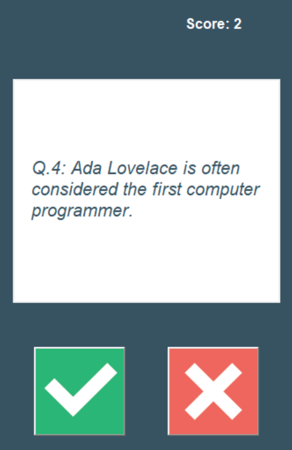

# Single Player Quiz Game
## Description
This is a single player quiz game. The user will be asked a series of questions and will be given a score at the end of the game.
## How to use
1. Clone the repository
2. Run the file `main.py`
3. Answer the questions
4. View your score at the end of the game
5. Play again if you want to :)

## Screenshots

Created as a part of Udemys 100 days of code course by Angela Yu.

